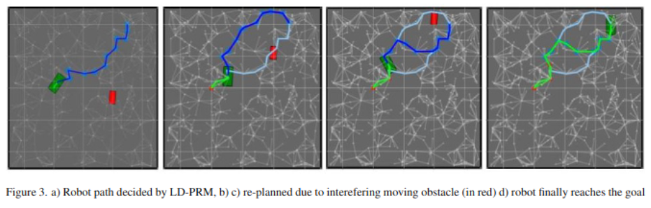
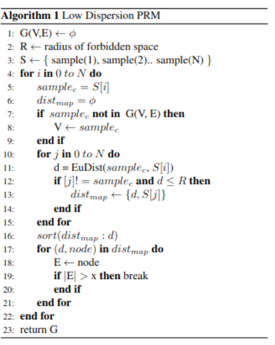

###   Final Project -  ENPM661:Robot planning
# LD-PRM-for-dynamic-environments

 To perform path planning under dynamic obstacle environments, our project implements a fast auto-adjusting probabilistic roadmap algorithm. The gen-
erated samples are stored in 2D array-like data structure, used as a lookup table to check if there are obstacles en- countered. If a sample lies within the obstacle, our algorithm adjusts the collision points so that we have samples free from the obstacle space. The roadmap adjusts itself
to have samples from the obstacle-free space whenever a change in the environment is observed. This report contains our experimentation and simulation of our implementation of this self-adjusting roadmap algorithm.

To run the codebase:

```
python3 main.py
```



#### Low Dispersion Probabilistic Roadmap:



Refer our report for full details.


#### Authors:
```
Name: Aswath Muthuselvam :
UID : 
```
```
Name: Gokul Hari
UID : 117430646
```
```
Name: Shailesh Pranav
UID :
```


#### References:
```BibTeX
@INPROCEEDINGS{8665326,  author={Khaksar, Weria and Uddin, Md Zia and Torresen, Jim},  
booktitle={2018 IEEE International Conference on Robotics and Biomimetics (ROBIO)},   
title={Self-Adjusting Roadmaps: A Fast Sampling-Based Path Planning Algorithm for Navigation in Unknown Environments},   
year={2018}, 
pages={1094-1101},  
doi={10.1109/ROBIO.2018.8665326}}
```
